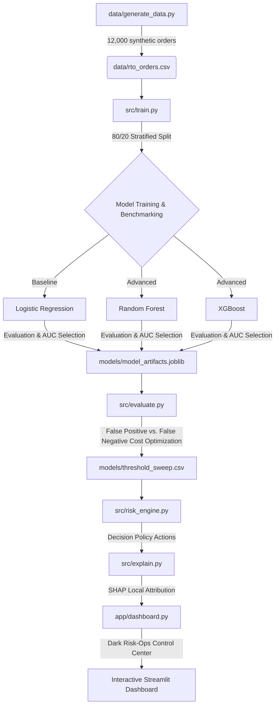

# 🛡️ Razorpay Return-Risk Scorer (AI Risk Manager)

An end-to-end, cost-sensitive Return-to-Origin (RTO) prediction and decision system built for the **Razorpay AI Buildathon (Track 2: AI Risk Manager)**.

---

## 📌 The Business Problem
Return-to-Origin (RTO) occurs when a shipped order is returned to a merchant before or during delivery. It is one of the most critical margin drains in Indian e-commerce, especially for Cash-on-Delivery (COD) transactions:
* **30-40%** of COD orders in India result in RTO, compared to only **5-10%** of prepaid orders.
* RTO shipments double logistics costs (wasted forward shipping + wasted return shipping).
* It costs Indian e-commerce an estimated **₹20,000 - ₹25,000 crore (~$2.5B - $3B)** annually.
* Behavioral factors (low intent, buyer remorse, impulsive ordering) drive **60-70%** of RTOs, rather than logistics failures like bad addresses.

This project implements a working risk detector, cost-aware policy optimizer, and SHAP auditor to help risk-ops teams score transaction risks *prior to dispatch* and decide whether to auto-ship, request SMS/IVR verification, or hold the order and require prepayment.

---

## 🏗️ System Architecture & Workflow

Below is the execution flow of the Return-Risk Scorer pipeline:



---

## 🔍 Why These Features?
The system utilizes 14 distinct risk features capturing location demographics, payment modes, transaction characteristics, and buyer behavior:
1. **Location Risk Profile:** `pincode_tier` (T1/T2/T3) and `pincode_rto_rate` (demographic baseline risk) represent local shipping behavior.
2. **Order Characteristics:** `payment_mode` (COD vs Prepaid), `order_value` (large orders represent higher RTO cash stakes), `discount_pct` (impulsive buys correlate with heavy discounts), and `is_weekend_order`.
3. **Address Quality Proxy:** `address_length` (completeness), `address_has_landmark`, and `pin_matches_city` (mismatch signals fraudulent/erroneous entry).
4. **Buyer History:** `customer_tenure_days` (loyalist tenure), `customer_past_orders`, and `customer_past_rto_rate` (personal historical return trends).

---

## 📊 Model Benchmarking (Held-out Test Set)

The models were trained on 9,600 samples and evaluated on a held-out test set of 2,400 samples (stratified 24.79% baseline RTO rate):

| Model | Accuracy | Precision | Recall | F1-Score | AUC-ROC |
| :--- | :--- | :--- | :--- | :--- | :--- |
| **Logistic Regression (Winner)** | **78.04%** | **61.64%** | **30.25%** | **40.59%** | **0.7892** |
| Random Forest | 77.17% | 63.58% | 18.49% | 28.65% | 0.7860 |
| XGBoost | 77.25% | 58.72% | 27.73% | 37.67% | 0.7837 |

*Note: All model metrics are realistic (AUC ~0.78-0.79) with no data leakage (no metric exceeds ~95%).*

---

## 🎯 Cost-Sensitive Optimization (differentiating insight)

A standard ML classifier uses an arbitrary probability cutoff of `0.50` to make decisions. In the real world, errors have different costs:
* **False Positive (FP):** Flagging a good transaction as RTO-risk. Cost = Lost margin on the sale (approx **₹150**).
* **False Negative (FN):** Approving a high-risk order that returns. Cost = Wasted round-trip shipping (approx **₹300**).

Since $FN\_cost > FP\_cost$ (shipping waste costs twice as much as a lost sale margin), the optimal decision threshold shifts **downwards to 0.30** (from 0.50). 

### 💸 Business Impact
* **Total test set loss at 0.50 cutoff:** ₹141,300.00
* **Total test set loss at optimal 0.30 threshold:** ₹124,200.00
* **Net Savings:** **₹17,100.00 (12.1% reduction in losses)**
* By shifting the threshold down, the engine catches **69.1%** of RTOs (Recall) compared to only **30.3%** at the default cutoff.

---

## ⚙️ Setup and Execution

### Prerequisites
Make sure you have Python 3.9+ and Homebrew installed.
Since XGBoost uses OpenMP, you must install the OpenMP library on macOS:
```bash
brew install libomp
```

### Installation
Clone the repository and install Python dependencies:
```bash
git clone https://github.com/stefinmathew66-lab/RazorPay.git
cd RazorPay
pip install -r requirements.txt
```

### Running the Pipeline (In Order)
1. **Generate Synthetic Data:**
   ```bash
   python3 data/generate_data.py
   ```
2. **Train Candidate Models:**
   ```bash
   python3 src/train.py
   ```
3. **Run Threshold Tuning:**
   ```bash
   python3 src/evaluate.py
   ```
4. **Generate Global SHAP Importances:**
   ```bash
   python3 src/explain.py
   ```
5. **Launch the Dashboard:**
   ```bash
   python3 -m streamlit run app/dashboard.py
   ```

---

## 🛡️ Strictly Defense-Only Compliance
This system is **strictly defense-only**, complying fully with Track 2 buildathon rules:
* It does **not** autonomously block transactions.
* It flags risks for human review or updates the payment/verification policies (e.g. asking a COD buyer to verify via SMS or switch to prepaid).
* All thresholds are completely transparent and configurable by the risk-ops team.

---

## 📝 Limitations & Future Work
* **Synthetic Data Caveat:** Real-world distributions will require continuous retraining to prevent feature and concept drift.
* **Live Courier Signals:** Integrating live courier performance and regional shipping delays into the location risk features would further improve precision.
* **Retraining Cadence:** Production systems should retrain the classifiers on a rolling 30-day window to adapt to shifting consumer shopping behaviors.
