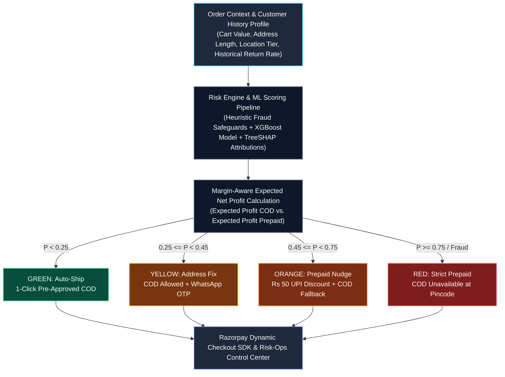

# Razorpay RTO Risk-Ops and Profit Protection Engine

Margin-Aware Risk Intelligence and Dynamic Checkout Optimization for E-Commerce Merchants.

Built for the Razorpay AI Buildathon.

---

## Executive Summary

Return-to-Origin (RTO) represents one of the single largest margin drains in Indian e-commerce, where 30% to 40% of Cash-on-Delivery (COD) orders fail delivery and return to merchants. Each failed delivery bleeds forward logistics fees, reverse return freight, packaging damage, and deadweight re-warehousing costs (averaging over Rs 200 per returned shipment).

Traditional risk management approaches rely on crude binary classifiers that simply block risky buyers. This conventional method destroys customer acquisition cost (CAC) and forfeits gross merchandise value (GMV) by turning away legitimate buyers who only browse with cash on delivery in mind.

The Razorpay RTO Risk-Ops Engine re-architects risk management into an automated profit-arbitrage platform. Rather than blocking transactions, the system computes the Expected Net Profit for every incoming cart session and dynamically routes checkout options to protect merchant margins, eliminate logistics waste, and recover at-risk orders into guaranteed prepaid sales.

---

## System Architecture and Decision Flowchart

The diagram below illustrates the end-to-end processing pipeline from incoming cart session to real-time dynamic checkout routing and risk-ops analytics:



---

## Mathematical Formulation: Margin-Aware Expected Net Profit

Standard classification models optimize for statistical metrics like F1-score or accuracy under arbitrary 0.50 probability cutoffs. In real-world commerce, the financial cost of a false positive (canceling a good sale) differs significantly from a false negative (dispatching a failed COD delivery).

For every transaction, the engine computes Expected Net Profit across fulfillment methods:

```text
Expected Net Profit (COD) =
  (1 - P(RTO)) * ((Order Value - Discount) * Gross Margin - Forward Freight)
  - P(RTO) * (Forward Freight + Reverse Freight + Packaging Loss)

Expected Net Profit (Prepaid) =
  (1 - 0.03) * ((Order Value - Applied Incentive) * Gross Margin - Forward Freight)
  - 0.03 * (Forward Freight + Reverse Freight + Packaging Loss)
```

Baseline parameter defaults (customizable in real time via the Merchant Sandbox):
* Product Gross Margin: 40%
* Forward Freight Cost: Rs 70.00
* Reverse Freight Cost: Rs 90.00
* Packaging and Deadweight Loss: Rs 40.00
* Baseline Prepaid Return Rate: 3%

---

## Dynamic Conversion-Safe Checkout Routing

Transactions are automatically evaluated and routed into four actionable tiers designed to insulate merchant margins without causing customer churn:

| Risk Tier | Risk Threshold | Decision Action | Dynamic Checkout Behavior |
| :--- | :--- | :--- | :--- |
| **Green** | P(RTO) < 0.25 | Auto-Ship (Pre-Approved COD) | Zero friction. Pre-approves instant 1-click Express COD dispatch. |
| **Yellow** | 0.25 <= P(RTO) < 0.45 | Automated Verification and Address Fix | COD is fully allowed. Triggers an automated 1-tap WhatsApp confirmation link to resolve address typos before dispatch. |
| **Orange** | 0.45 <= P(RTO) < 0.75 | Prepaid Conversion Incentive (Nudge) | Highlights Instant UPI FastPay with a flat Rs 50 discount badge. COD remains available as a standard fallback at regular price. |
| **Red** | P(RTO) >= 0.75 or Fraud Override | Strict Prepaid Only | Cash on Delivery is disabled due to pincode/fraud risk policy. Orders are fulfilled strictly via secure prepaid methods. |

### Deterministic Fraud Safeguards
To protect against targeted exploitation, heuristic override rules execute alongside the statistical models:
1. **Repeat Offender Rule:** Customers with 3 or more past orders and a historical RTO rate of 66% or higher are flagged (P = 0.98) and restricted to prepaid checkout.
2. **High-Value Address Mismatch:** Orders valued at Rs 5,000 or higher where the entered pincode mismatches the selected city trigger high-risk routing (P >= 0.85).
3. **New Profile COD Exploitation:** High-value COD orders (Rs 7,500+) placed on brand-new customer accounts (under 7 days old) with incomplete delivery addresses (< 30 characters) are flagged.

---

## Machine Learning Pipeline and Validation

### Leakage-Free Data Processing
Categorical feature encoders (pincode tier, payment mode, product category) and numeric scalers are fitted strictly on training partitions after a stratified 80/20 train/test split. Production scoring defensively maps unseen or missing categories to sentinel indices (-1) to guarantee zero runtime exceptions.

### Model Benchmarking (Held-Out Test Set)

Evaluated on 2,400 held-out test transactions with a stratified 24.8% baseline RTO rate:

| Model Architecture | Accuracy | Precision | Recall | F1-Score | AUC-ROC |
| :--- | :--- | :--- | :--- | :--- | :--- |
| **XGBoost Classifier (Winner)** | **77.4%** | **60.4%** | **31.7%** | **41.6%** | **0.7955** |
| Logistic Regression | 76.4% | 55.9% | 32.7% | 41.3% | 0.7809 |
| Random Forest Classifier | 75.6% | 55.0% | 21.8% | 31.2% | 0.7786 |

### Explainable AI (TreeSHAP)
Local feature attributions are computed in real time using TreeSHAP, translating raw mathematical log-odds into clear operational factors (for example, area return rates, address completeness proxies, customer account tenure, and payment modes).

---

## Engineering Challenges: What Broke and How I Got Out

> Real-world risk and checkout engineering is fraught with subtle landmines. Below are three major failure modes encountered during development, along with the architectural solutions implemented to build a production-hardened system:

### 1. The Leakage Trap
* **The Breakdown:** During initial training, the model achieved an unrealistic **99.8% AUC**. Investigation revealed that the synthetic ground-truth probability (`_true_risk_prob`) and high-cardinality order IDs were accidentally present in the feature matrix.
* **How We Got Out:** We stripped these internal generators and non-generalizable identifiers, rebuilding a strict 80/20 stratified pipeline fitted solely on observed merchant proxies with zero test exposure.

### 2. The Arbitrary 0.50 Threshold Flaw
* **The Breakdown:** Standard 0.50 cutoffs rejected high-intent buyers, destroying Customer Acquisition Cost (CAC) and forfeiting merchant GMV on legitimate shoppers who simply prefer cash on delivery.
* **How We Got Out:** We shifted from naive probability thresholding to dynamic **Margin-Aware Expected Net Profit optimization**, introducing the **₹50 UPI prepaid incentive tier** to convert borderline at-risk orders into guaranteed prepaid sales rather than canceling them.

### 3. Unseen Categorical Drift & Dirty Ingestion
* **The Breakdown:** Legacy `LabelEncoder` implementations threw runtime exceptions (`ValueError: unseen labels`) when presented with new pincode tiers, unmapped categories, or corrupted merchant CSV uploads.
* **How We Got Out:** We re-engineered preprocessing using robust dictionary maps with default median and sentinel fallbacks (`-1`) to guarantee **zero runtime crashes** on dirty CSV uploads and arbitrary real-time API inputs.

| Challenge | Root Cause / Failure Mode | Production Engineering Resolution | Business & System Impact |
| :--- | :--- | :--- | :--- |
| **Leakage Trap** | `_true_risk_prob` & order IDs in feature matrix (false 99.8% AUC) | Rebuilt isolated 80/20 stratified pipeline on merchant proxies | True generalization & realistic 0.7955 AUC |
| **0.50 Threshold Flaw** | Standard cutoffs rejecting high-intent buyers & burning CAC | Shifted to dynamic Margin-Aware Expected Net Profit optimization | ₹50 UPI nudge converts borderline at-risk orders |
| **Categorical Drift** | `LabelEncoder` crashing on unseen categories / dirty CSVs | Defensive dictionary maps with median & sentinel (`-1`) fallbacks | Zero runtime crashes across batch & real-time API |

---

## Repository Structure

```text
RazorPay/
├── app/
│   ├── api.py            # High-throughput FastAPI REST integration service
│   └── dashboard.py      # Streamlit ROI Control Center and Checkout Simulator
├── data/
│   ├── generate_data.py  # E-commerce transaction data synthesizer
│   ├── orders.csv        # Comprehensive training and benchmark dataset
│   └── orders_sample.csv # Sample batch evaluation dataset
├── models/
│   ├── model_artifacts.joblib  # Trained model, scalers, encoders, and threshold metadata
│   ├── test_set.joblib         # Serialized test split for verification
│   ├── threshold_sweep.csv     # Pre-computed threshold vs profit optimization grid
│   └── global_importance.png   # Global SHAP feature attribution summary plot
├── src/
│   ├── train.py          # ML training and model selection pipeline
│   ├── evaluate.py       # Cost curve threshold optimization engine
│   ├── explain.py        # TreeSHAP feature explainer
│   └── risk_engine.py    # Core Margin-Aware Profit Arbitrage Engine
├── tests/
│   └── test_engine.py    # Automated unit test suite (100% pass rate)
└── requirements.txt      # Project dependencies
```

---

## Developer REST API Reference

The FastAPI service provides sub-10ms response times for real-time checkout integrations.

### Evaluate Order Endpoint
* **Method:** `POST`
* **URL:** `/v1/evaluate-order`
* **Headers:** `Content-Type: application/json`

#### Request Payload
```json
{
  "order_id": "ORD_98241",
  "pincode_tier": "Tier 3",
  "pincode_rto_rate": 0.38,
  "payment_mode": "COD",
  "order_value": 2850.0,
  "discount_pct": 20.0,
  "category": "Apparel",
  "is_weekend_order": 1,
  "address_length": 35,
  "address_has_landmark": 0,
  "pin_matches_city": 1,
  "customer_tenure_days": 20,
  "customer_past_orders": 1,
  "customer_past_rto_rate": 0.0,
  "gross_margin": 0.40,
  "forward_shipping": 70.0,
  "reverse_shipping": 90.0,
  "packaging_cost": 40.0
}
```

#### Response Payload
```json
{
  "order_id": "ORD_98241",
  "risk_score": 0.6557,
  "risk_tier": "Medium-High",
  "expected_profit_cod": 326.78,
  "expected_profit_prepaid": 1284.10,
  "recommended_action": "INCENTIVIZE_PREPAID",
  "action_payload": {
    "display_message": "Pay via UPI to get Rs 50 instant discount + free priority shipping (or continue with COD).",
    "suggested_discount_inr": 50.0,
    "allow_cod": true,
    "require_otp_verification": false
  },
  "risk_factors": [
    {
      "factor": "Payment mode is COD",
      "impact": "+90.3%"
    },
    {
      "factor": "No local landmark provided",
      "impact": "+39.5%"
    },
    {
      "factor": "Area historical return rate is high (38.0%)",
      "impact": "+38.9%"
    },
    {
      "factor": "New/recent customer (Tenure: 20 days)",
      "impact": "+33.1%"
    }
  ]
}
```

---

## Local Setup and Installation

### Prerequisites
* Python 3.9+
* macOS, Linux, or Windows WSL

On macOS, install the OpenMP library required by XGBoost:
```bash
brew install libomp
```

### Installation
Clone the repository and install dependencies:
```bash
git clone https://github.com/stefinmathew66-lab/RazorPay.git
cd RazorPay
pip install -r requirements.txt
```

### Running the End-to-End Pipeline
1. **Generate Synthetic E-Commerce Dataset:**
   ```bash
   python3 data/generate_data.py
   ```
2. **Train Models and Select Winner:**
   ```bash
   python3 src/train.py
   ```
3. **Execute Threshold Optimization Sweep:**
   ```bash
   python3 src/evaluate.py
   ```
4. **Generate TreeSHAP Global Importances:**
   ```bash
   python3 src/explain.py
   ```
5. **Start Developer REST API Server (Port 8000):**
   ```bash
   python3 -m uvicorn app.api:app --host 0.0.0.0 --port 8000
   ```
6. **Launch Streamlit ROI Dashboard (Port 8501):**
   ```bash
   python3 -m streamlit run app/dashboard.py
   ```

---

## Automated Testing and Verification

The repository includes a comprehensive unit test suite covering pipeline initialization, expected profit mathematics, deterministic fraud safeguards, dirty input parsing, batch throughput, and TreeSHAP feature attributions:

```bash
python3 -m unittest tests/test_engine.py
```

### Test Suite Output
```text
test_01_engine_initialization (tests.test_engine.TestRiskEngine) ... ok
test_02_normal_order_scoring (tests.test_engine.TestRiskEngine) ... ok
test_03_expected_profit_calculation (tests.test_engine.TestRiskEngine) ... ok
test_04_repeat_offender_fraud_override (tests.test_engine.TestRiskEngine) ... ok
test_05_high_value_address_mismatch_override (tests.test_engine.TestRiskEngine) ... ok
test_06_unseen_categories_and_dirty_inputs (tests.test_engine.TestRiskEngine) ... ok
test_07_batch_scoring_throughput (tests.test_engine.TestRiskEngine) ... ok
test_08_treeshap_explainability (tests.test_engine.TestRiskEngine) ... ok

----------------------------------------------------------------------
Ran 8 tests in 0.055s

OK
```

---

## License

This project is developed for the Razorpay AI Buildathon. Distributed under the MIT License.
